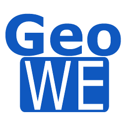
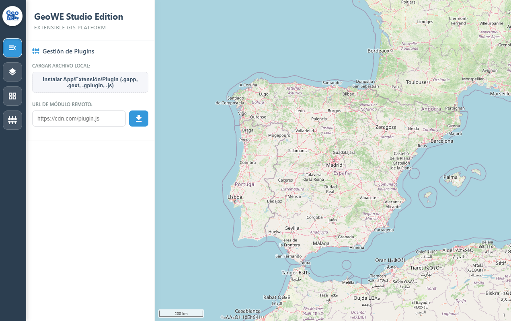

# GeoWE Studio
### SIG Extensible para la Web Moderna

<p align="center">
  
</p>

**GeoWE Studio** no es solo un SIG; es un **Runtime + SDK** de código abierto diseñado específicamente para construir aplicaciones SIG en la web. Su objetivo es proporcionar una infraestructura extensible basada en estándares OGC que permite crear herramientas geoespaciales a medida mediante una arquitectura de micro-plugins agnóstica al framework.

<p align="center">
  
</p>
  

Puedes acceder a **GeoWE Studio** desde [aquí](https://jmmluna.github.io/geowe-studio/studio/bin)


---

## ✨ Características Principales
- 🌍 **Motor OpenLayers**: Visualización y edición de datos geoespaciales profesional.
- 🔌 **Ecosistema Universal**: Soporte nativo para **VanillaJS, TypeScript, Vue, React, Angular, Svelte y Nuxt**.
- 🛡️ **Sandboxing & Seguridad**: Aislamiento de capas de UI para proteger el núcleo.
- 🧩 **Herramientas Nativas**: Gestor de Capas, Catálogo de Servicios (PNOA/IGN) e Info de Plugins integrados.
- 📐 **Interoperabilidad**: Soporte avanzado para múltiples proyecciones y formatos (GeoJSON, SHP, KML, GeoPackage).
- ⚡ **Carga Dinámica (ESM)**: Sistema de carga de módulos nativo que garantiza un núcleo ligero y rápido.
- 🌍 **Ejecución vía URL**: Soporta parámetros (`?app=`, `?plugin=`) para cargar configuraciones remotas, facilitando el empotrado en otras webs.

---

## 📚 Documentación para Desarrolladores
Hemos estructurado la documentación técnica en secciones especializadas para facilitar su acceso:

### ⚡ [Guía de Inicio Rápido (Quick Start)](docs/QUICKSTART.md)
**Empieza aquí**: Crea y ejecuta tu primer plugin en menos de 5 minutos siguiendo este tutorial paso a paso.

### 🚀 [Guía de Desarrollo Detallada](docs/DEVELOPMENT.md)
Aprende a usar **GeoWE Forge**, descubre la API de **PluginContext** (UI, Mapa, Eventos) y cómo integrar tus propios componentes de Vue o React.

### ⚙️ [Arquitectura y Estabilidad](docs/ARCHITECTURE.md)
Detalles técnicos sobre la carga dinámica de módulos, el sistema de sandboxing de la interfaz y las mejoras de estabilidad en el núcleo del sistema.

---

## 🛠️ Instalación y Uso

### Ejecutar el Studio
```bash
npm install
npm run dev
```

### Desarrollar un Plugin
Para compilar y empaquetar un plugin como el **Layer Exporter (Vue 3)**:
```bash
cd plugins/layer-exporter-vue
npm install
npm run build
```
El archivo resultante `.gplugin` se puede cargar directamente en la interfaz de GeoWE Studio.

---

## 🏗️ Estado del Proyecto
Actualmente GeoWE Studio se encuentra en fase de evolución activa. 

---

## 📝 Licencia
Este proyecto es software libre y de código abierto, distribuido bajo la **[Licencia Apache 2.0](LICENSE)**. 

[](https://opensource.org/licenses/Apache-2.0)

*GeoWE Studio: Haciendo el SIG accesible para todos bajo los valores de GeoWE.*
